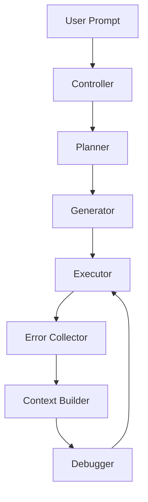
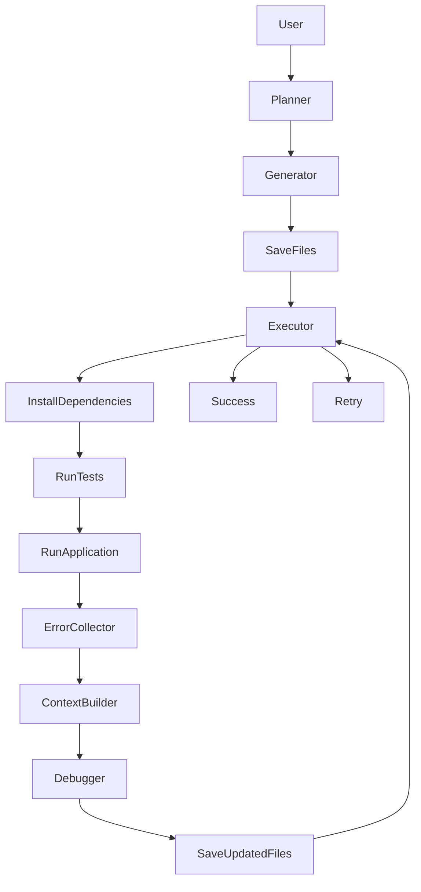

# 🤖 AutoDev Agent

> **An Autonomous AI Software Engineering Agent powered by Local Large Language Models**


---

# 📖 Table of Contents

- Overview
- Motivation
- Features
- System Architecture
- Workflow
- Project Structure
- Components
- Installation
- Requirements
- Model Setup
- Usage
- Example Execution
- Technologies Used
- Current Limitations
- Roadmap
- Future Improvements
- Contributing
- License
- Author

---

# 🚀 Overview

(Explain what the project is.)

---

# 💡 Motivation

(Why you built it.)

---

# ✨ Features

| Feature | Status |
|----------|--------|
| Natural Language Project Generation | ✅ |
| Automatic Project Planning | ✅ |
| Multi-file Code Generation | ✅ |
| Dependency Installation | ✅ |
| Automatic Execution | ✅ |
| Unit Test Execution | ✅ |
| Runtime Error Collection | ✅ |
| Context-aware Debugging | ✅ |
| Iterative Repair Loop | ✅ |
| Local LLM Support | ✅ |

---

# 🏗️ System Architecture



---

# 🔄 Workflow



---

# 📂 Project Structure

```text
AutoDev-Agent/

│
├── core/
│   ├── controller.py
│   ├── planner.py
│   ├── generator.py
│   ├── executor.py
│   ├── debugger.py
│   ├── context_builder.py
│   ├── error_collector.py
│   └── engine.py
│
├── models/
│
├── generated_projects/
│
├── requirements.txt
├── README.md
└── main.py
```

---

# ⚙️ Components

## Controller

(Description)

---

## Planner

(Description)

---

## Generator

(Description)

---

## Executor

(Description)

---

## Error Collector

(Description)

---

## Context Builder

(Description)

---

## Debugger

(Description)

---

## Engine

(Description)

---

# 🧠 How It Works

```text
User Prompt

↓

Planner creates project structure

↓

Generator creates files

↓

Executor installs dependencies

↓

Executor runs unit tests

↓

Executor runs application

↓

Error Collector gathers errors

↓

Context Builder prepares debugging context

↓

Debugger repairs project

↓

Repeat until success
```

---

# 💻 Installation

```bash
git clone https://github.com/<username>/AutoDev-Agent.git

cd AutoDev-Agent

pip install -r requirements.txt
```

---

# 📋 Requirements

- Python 3.10+
- PyTorch
- Transformers
- Accelerate
- HuggingFace
- CUDA (Optional)

---

# 🤖 Model Setup

Download

Qwen2.5-Coder-7B-Instruct

from HuggingFace.

Place it inside

```
models/
```

---

# ▶️ Running

```bash
python main.py
```

---

# 📌 Example

Input

```text
Create a Python Calculator Application
```

Output

```text
Planning Project...

Generating Files...

Executing...

Running Tests...

Collecting Errors...

Debugging...

Project Completed Successfully.
```

---

# 🛠️ Technologies Used

| Technology | Purpose |
|------------|----------|
| Python | Core Development |
| PyTorch | Model Inference |
| Transformers | LLM Interface |
| HuggingFace | Model Loading |
| unittest | Unit Testing |

---

# 📊 Current Capabilities

| Capability | Supported |
|------------|-----------|
| Python Projects | ✅ |
| Multi-file Generation | ✅ |
| Automatic Debugging | ✅ |
| Automatic Testing | ✅ |
| Local Models | ✅ |
| Java Support | ❌ |
| Docker Support | ❌ |
| Memory | ❌ |
| Multi-Agent System | ❌ |

---

# ⚠️ Current Limitations

- Optimized for Python projects
- Requires local LLM
- Large models require significant GPU memory
- No persistent memory
- Single-agent architecture
- No web search integration

---

# 🛣️ Roadmap

## Version 1 ✅

- Project Planning
- Code Generation
- Execution
- Testing
- Debugging
- Retry Loop

---

## Version 2 🚧

- Multi-Agent Architecture
- Automatic Test Generator
- Code Review Agent
- Memory
- Docker Support
- Git Integration
- Multi-language Support

---

## Version 3 🔮

- Autonomous Software Engineering Team
- Self Improvement
- Benchmarking
- Cloud Deployment
- IDE Plugin
- Continuous Learning

---

# 🤝 Contributing

Contributions are welcome.

1. Fork the repository.
2. Create a new branch.
3. Commit your changes.
4. Submit a Pull Request.

---

# 📜 License

MIT License

---

# 👨‍💻 Author

**V. Sri Mahesh Abhiram**

B.Tech Artificial Intelligence & Data Science

GitHub:
https://github.com/Abhiram2005-pro

LinkedIn:
(Add your LinkedIn)

---

# ⭐ Support

If you found this project useful, please consider giving it a ⭐ on GitHub.
