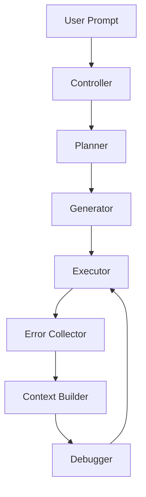
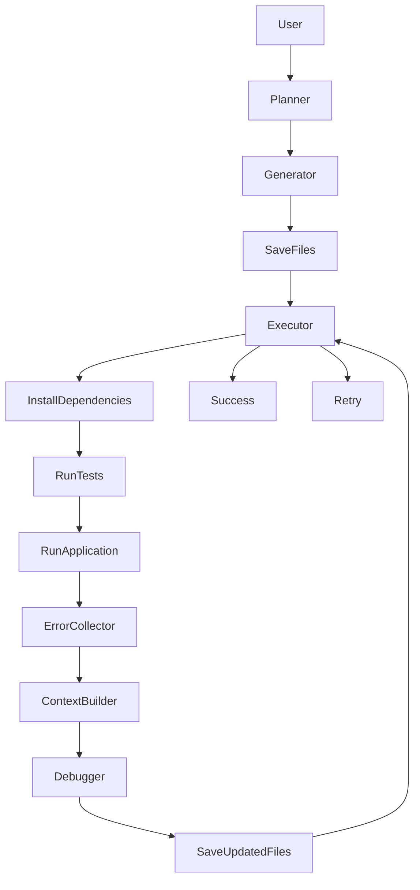

# 🤖 AutoDev Agent

> **An Autonomous AI Software Engineering Agent powered by Local Large Language Models**


---

# 📖 Table of Contents

- Overview
- Motivation
- Features
- System Architecture
- Workflow
- Project Structure
- Components
- Installation
- Requirements
- Model Setup
- Usage
- Example Execution
- Technologies Used
- Current Limitations
- Roadmap
- Future Improvements
- Contributing
- License
- Author

---

# 🚀 Overview


AutoDev Agent is an autonomous AI software engineering system designed to automate the end-to-end software development workflow using a locally hosted Large Language Model (LLM). Unlike traditional AI code assistants that generate code based on individual prompts, AutoDev Agent follows a structured software engineering pipeline that plans a project, generates source files, executes the generated code, validates functionality through automated testing, collects runtime errors, and iteratively debugs the project until it successfully executes or reaches a predefined retry limit.

The system is built around a modular architecture where each component is responsible for a specific stage of the development lifecycle. This separation of responsibilities improves maintainability, extensibility, and enables future integration of advanced capabilities such as multi-agent collaboration, long-term memory, automatic code review, and self-improving development workflows.

AutoDev Agent currently operates entirely on local Large Language Models, allowing software generation without relying on external APIs while providing complete control over the development pipeline. The project serves as a foundation for building intelligent autonomous software engineering systems capable of assisting developers in creating complete software projects with minimal human intervention.

---

# 💡 Motivation

Large Language Models have significantly improved software development by enabling developers to generate code through natural language prompts. However, most existing AI coding assistants primarily focus on code generation and still require continuous human involvement for project planning, dependency management, execution, testing, debugging, and iterative refinement.

Developers often spend considerable time switching between writing code, executing programs, interpreting error messages, and manually requesting fixes from AI assistants. This repetitive workflow limits the level of automation that current AI-assisted development tools can provide.

AutoDev Agent was developed to address this limitation by automating the complete software engineering pipeline rather than only generating source code. The goal is to create an intelligent system capable of planning software projects, generating complete project structures, executing applications, validating functionality through automated testing, collecting runtime errors, constructing debugging context, and iteratively repairing the generated code with minimal human intervention.

The project also serves as a foundation for future research in autonomous software engineering, where multiple AI agents can collaboratively design, develop, validate, and improve software systems with progressively decreasing levels of human supervision.

---

# ✨ Features

| Feature | Status |
|----------|--------|
| Natural Language Project Generation | ✅ |
| Automatic Project Planning | ✅ |
| Multi-file Code Generation | ✅ |
| Dependency Installation | ✅ |
| Automatic Execution | ✅ |
| Unit Test Execution | ✅ |
| Runtime Error Collection | ✅ |
| Context-aware Debugging | ✅ |
| Iterative Repair Loop | ✅ |
| Local LLM Support | ✅ |

---

# 🏗️ System Architecture



---

# 🔄 Workflow



---

# 📂 Project Structure

```text
AutoDev-Agent/

│
├── core/
│   ├── controller.py
│   ├── planner.py
│   ├── generator.py
│   ├── executor.py
│   ├── debugger.py
│   ├── context_builder.py
│   ├── error_collector.py
│   └── engine.py
│
├── models/
│
├── generated_projects/
│
├── requirements.txt
├── README.md
└── main.py
```

---

# ⚙️ Components

## 🎯 Controller

The **Controller** acts as the central orchestrator of the AutoDev Agent. It coordinates the complete software engineering workflow by invoking each module in the correct sequence. Starting from the user's prompt, the Controller manages project planning, code generation, execution, testing, debugging, and retry operations until the project executes successfully or reaches the maximum retry limit. It serves as the decision-making unit that controls the entire autonomous development lifecycle.

---

## 📐 Planner

The **Planner** is responsible for transforming a natural language software requirement into a structured project blueprint. Instead of generating code directly, it analyzes the user's request and determines the required directory structure, source files, configuration files, and testing modules. This planning stage provides the overall architecture that guides the subsequent code generation process.

---

## 💻 Generator

The **Generator** converts the project plan into executable source code by generating each file individually using the local Large Language Model. It creates implementation files, configuration files, documentation, and supporting resources while maintaining consistency across the entire project structure. File-by-file generation enables easier debugging and future extensibility.

---

## ▶️ Executor

The **Executor** validates the generated project by executing multiple stages of the software development pipeline. It automatically installs project dependencies, executes unit tests, and runs the generated application. The execution results determine whether the project has been successfully completed or requires further debugging. This module provides the runtime feedback necessary for autonomous software repair.

---

## 🐞 Error Collector

The **Error Collector** captures detailed diagnostic information whenever project execution fails. It records runtime exceptions, stack traces, standard output, standard error, exit codes, and unit test failures. Rather than attempting to repair the project itself, it gathers comprehensive debugging information that can later be analyzed by the debugging system.

---

## 🧠 Context Builder

The **Context Builder** prepares structured debugging information for the Large Language Model. It combines the original user request, current project structure, generated source code, execution logs, runtime errors, unit test results, and previous debugging attempts into a unified context. Providing complete project context enables the debugging model to generate more accurate and targeted fixes.

---

## 🔧 Debugger

The **Debugger** is responsible for repairing projects that fail during execution. Using the structured context generated by the Context Builder, it identifies faulty source files and produces corrected implementations while preserving the remaining project structure. After the modified files are written back to the project, the Controller initiates another execution cycle, enabling iterative autonomous debugging.

---

## ⚡ Engine

The **Engine** serves as the interface between AutoDev Agent and the local Large Language Model. It manages model loading, tokenization, prompt execution, inference, response generation, and GPU resource utilization. By abstracting the interaction with the underlying language model, the Engine provides a reusable inference layer that can be extended to support different models in future versions.

# 🧠 How It Works

```text
User Prompt

↓

Planner creates project structure

↓

Generator creates files

↓

Executor installs dependencies

↓

Executor runs unit tests

↓

Executor runs application

↓

Error Collector gathers errors

↓

Context Builder prepares debugging context

↓

Debugger repairs project

↓

Repeat until success
```

---

# 💻 Installation

```bash
git clone https://github.com/<username>/AutoDev-Agent.git

cd AutoDev-Agent

pip install -r requirements.txt
```

---

# 📋 Requirements

- Python 3.10+
- PyTorch
- Transformers
- Accelerate
- HuggingFace
- CUDA (Optional)

---

# 🤖 Model Setup

Download

Qwen2.5-Coder-7B-Instruct

from HuggingFace.

Place it inside

```
models/
```

---

# ▶️ Running

```bash
python main.py
```

---

# 📌 Example

Input

```text
Create a Python Calculator Application
```

Output

```text
Planning Project...

Generating Files...

Executing...

Running Tests...

Collecting Errors...

Debugging...

Project Completed Successfully.
```

---

# 🛠️ Technologies Used

| Technology | Purpose |
|------------|----------|
| Python | Core Development |
| PyTorch | Model Inference |
| Transformers | LLM Interface |
| HuggingFace | Model Loading |
| unittest | Unit Testing |

---

# 📊 Current Capabilities

| Capability | Supported |
|------------|-----------|
| Python Projects | ✅ |
| Multi-file Generation | ✅ |
| Automatic Debugging | ✅ |
| Automatic Testing | ✅ |
| Local Models | ✅ |
| Java Support | ❌ |
| Docker Support | ❌ |
| Memory | ❌ |
| Multi-Agent System | ❌ |

---

# ⚠️ Current Limitations

- Optimized for Python projects
- Requires local LLM
- Large models require significant GPU memory
- No persistent memory
- Single-agent architecture
- No web search integration

---

# 🛣️ Roadmap

## Version 1 ✅

- Project Planning
- Code Generation
- Execution
- Testing
- Debugging
- Retry Loop

---

## Version 2 🚧

- Multi-Agent Architecture
- Automatic Test Generator
- Code Review Agent
- Memory
- Docker Support
- Git Integration
- Multi-language Support

---

## Version 3 🔮

- Autonomous Software Engineering Team
- Self Improvement
- Benchmarking
- Cloud Deployment
- IDE Plugin
- Continuous Learning

---

# 🤝 Contributing

Contributions are welcome.

1. Fork the repository.
2. Create a new branch.
3. Commit your changes.
4. Submit a Pull Request.

---

# 📜 License

MIT License

---

# 👨‍💻 Author

**V. Sri Mahesh Abhiram**

B.Tech Artificial Intelligence & Data Science

GitHub:
https://github.com/Abhiram2005-pro

LinkedIn:
(Add your LinkedIn)

---

# ⭐ Support

If you found this project useful, please consider giving it a ⭐ on GitHub.
